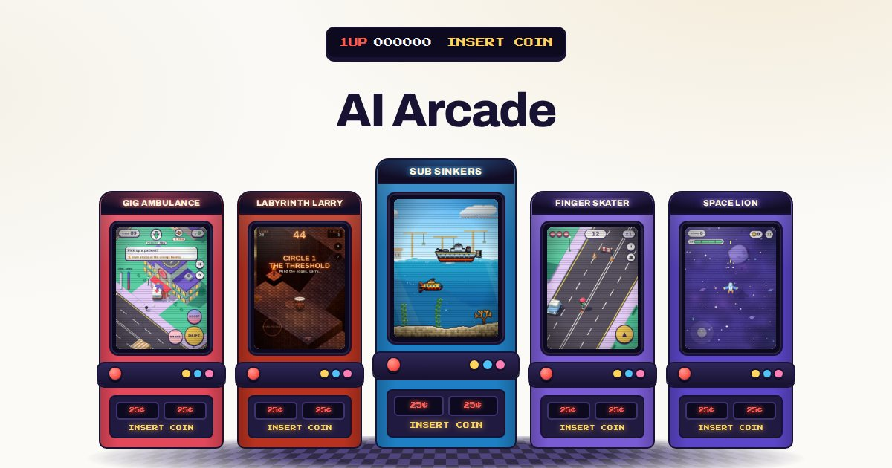

# AI Arcade

A home for the browser games in [mtd-public](https://github.com/mtd-public), each designed by grizzly-dev and built with AI. Every game gets an arcade-cabinet card on the home page and its own page with a description, controls, and a player that runs the game right on the page.



- **Test site:** https://mtd-public.github.io/ai-arcade/ (live once GitHub Pages is on, see [Deploy](#deploy))
- **Styling:** the cream, navy and gold look, fonts, buttons and cards come from [modern-portfolio](https://github.com/mtd-public/modern-portfolio). On top of that sit the arcade pieces: cabinet cards with lit marquees and CRT screens, 1UP / INSERT COIN / FREE PLAY HUD text in *Press Start 2P*, spinning coins, a coin-slot play button, and a GAME OVER 404 page.
- **No dependencies.** A small Node script turns the game list into plain static HTML. There's nothing to `npm install`, and the output works on any static host.
- **Ready for AdSense, but off.** The ad slots, `ads.txt`, the verification tags and the privacy-policy wording all turn on from one setting. See [docs/ADSENSE.md](docs/ADSENSE.md).

## Quick start

Needs Node 20 or newer.

```sh
npm run dev      # build, serve at http://localhost:8080/ai-arcade/, rebuild + reload on save
npm run build    # write the site to dist/
npm run check    # build for github.io and for a root domain, check every link and page
npm run preview  # serve the current build without watching
```

## Add a game

1. **Add an entry** to [`src/data/games.mjs`](src/data/games.mjs). Copy an existing one. The comment at the top of the file explains each field. The build stops with a clear message if something required is missing.
2. **Add a cover screenshot** at `src/static/img/games/<slug>.webp`, 600×800 (3:4 portrait). A phone screenshot taken mid-game and cropped to 3:4 works well. Without a cover, the card shows a coloured title plate.
3. **Write real copy.** Two or three paragraphs of description, the controls and a few tips. Original text on every page is what AdSense reviewers look for, and it helps people find the game in search.
4. Optionally render its social-share image: `npm run images -- <slug>` (needs Playwright, see [`tools/make-images.mjs`](tools/make-images.mjs)).
5. `npm run check`, commit, push. The site redeploys.

Set `embed: false` for a game that shouldn't run inside the page (for example, one that needs pointer lock). It then opens in a new tab instead.

## Project layout

```
site.config.mjs            Site name, address, contact, AdSense settings
src/data/games.mjs         The game catalog
src/templates/             Page templates (plain JS template strings)
  layout.mjs                 <head>, header, footer; the AdSense loader goes here
  components.mjs             cabinet card, coin, header/footer, ad slots
  home.mjs  game.mjs  info.mjs   home, game pages, about/contact/privacy/404
src/static/                Copied as-is: css/, js/, img/, favicon
scripts/build.mjs          Validates the catalog, renders pages, writes sitemap/robots/ads.txt
scripts/serve.mjs          Local server with live reload
scripts/check.mjs          Link and page checker (runs in CI)
tools/make-images.mjs      Renders social-share images from the site's own CSS
.github/workflows/deploy.yml   Check, build and deploy to GitHub Pages
docs/                      AdSense and custom-domain guides
```

## Deploy

### GitHub Pages (the test site)

1. In this repo, open **Settings → Pages**. Under **Build and deployment**, set **Source** to **GitHub Actions**.
2. Push to `main`, or run the **Deploy to GitHub Pages** workflow from the **Actions** tab.
3. The site appears at `https://mtd-public.github.io/ai-arcade/`.

The workflow asks GitHub Pages for the site's address and builds for it, so links, the sitemap and canonical URLs are always right for wherever it's served.

### Your own domain

AdSense needs a domain you own. You can keep hosting on GitHub Pages and point the domain at it, or build once and upload `dist/` to any other static host. [docs/CUSTOM-DOMAIN.md](docs/CUSTOM-DOMAIN.md) has the DNS records and steps for both.

## Ads

[docs/ADSENSE.md](docs/ADSENSE.md) covers the whole path: what to have in place before applying, signing up, connecting and verifying the site, the review, where the ads go on each page, consent messages for Europe, `ads.txt`, and getting paid.

The short version of where things live in the code:

| What | Where |
|---|---|
| Publisher ID and ad unit IDs | `ads` in [`site.config.mjs`](site.config.mjs) |
| AdSense loader script + `google-adsense-account` meta tag | [`src/templates/layout.mjs`](src/templates/layout.mjs), added to `<head>` when `ads.client` is set |
| Ad units (`<ins class="adsbygoogle">`) | `adSlot()` in [`src/templates/components.mjs`](src/templates/components.mjs), placed by `home.mjs` and `game.mjs` |
| `ads.txt` | Written to the site root by [`scripts/build.mjs`](scripts/build.mjs) when `ads.client` is set |
| Advertising section of the privacy policy | `privacyPage()` in [`src/templates/info.mjs`](src/templates/info.mjs), switches on with `ads.client` |

Until then, dashed "Ad space" boxes show where each unit will go. Turn them off with `ads.showPlaceholders: false`.
